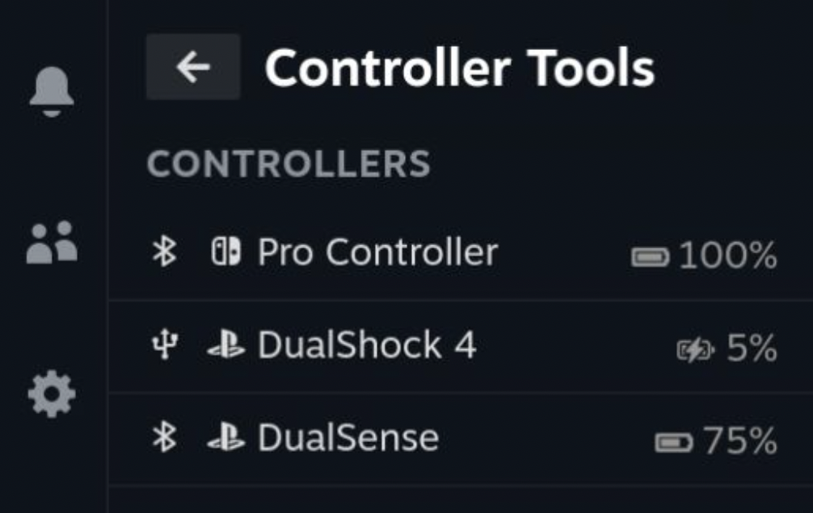

# Controller Tools

Steam Deck game controller plugin for [Decky Loader](https://github.com/SteamDeckHomebrew/decky-loader). Displays the connection type (Bluetooth, USB), current battery %, and charging status. 

## Supported Controllers
* PlayStation DualSense
* Playstation DualShock 4
* Nintendo Switch Pro Controller
* Xbox Series X|S Controller (limited support)
* Xbox One Controller (limited support)

## Installation
1. Install [Decky Loader](https://github.com/SteamDeckHomebrew/decky-loader).
2. Find the plugin in the Decky Store and install it.
